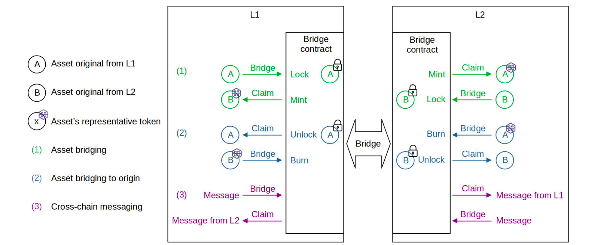
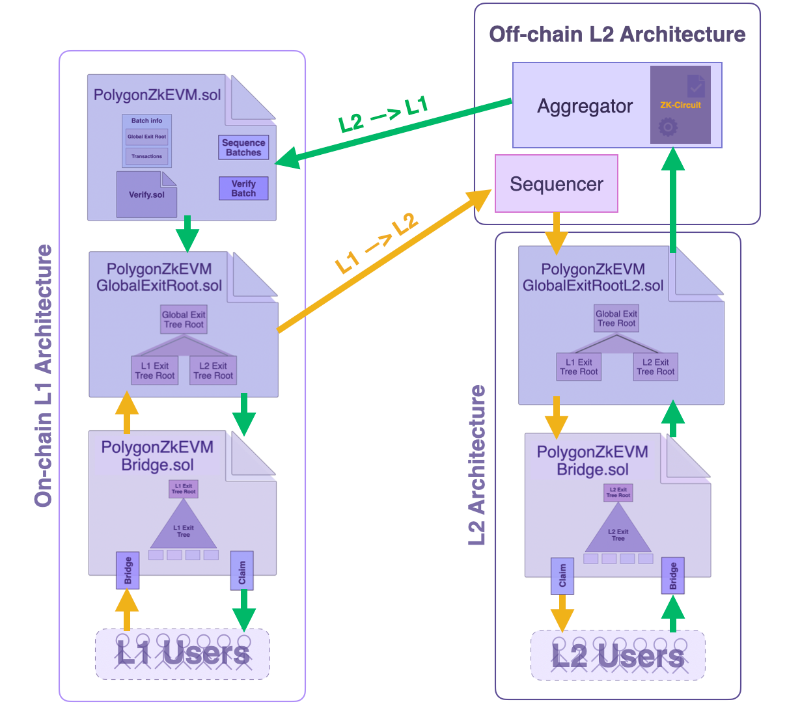

The ability of any blockchain to exchange data with other blockchains is critical for it to participate in an ecosystem of other blockchains; this is known as **interoperability**. Many interoperability-enabling solutions have been developed, each with their own set of advantages and disadvantages.

The Polygon team has created an interoperability solution in the form of a bridge for the Polygon zkEVM L2 network. The zkEVM Bridge is a component that enables communication and asset migration between the Polygon zkEVM network and other networks, such as the L1 (Ethereum Mainnet) or any L2 built on top of Ethereum.

The ability to transfer an asset from one network to another without changing the original asset's value or functionality is critical from the user's perspective. In addition, cross-chain messaging is supported, allowing payloads to be sent between networks.

In L2 rollups such as the Polygon zkEVM, L1 smart contracts ensure proper management of L2 state transitions and data availability. As a result, with an appropriate L2 architecture design, both ends of the Bridge smart contract (SC) can be synchronized entirely through the smart contract's logic.

## zkEVM Bridge Schema

Let's understand the zKEVM Bridge protocol design through an analogy. Make sure to check out the below illustration for easier understanding of the protocol.

Consider two networks; L1 and L2. In order **to bridge an asset between L1 and L2, a user has to lock the asset in the origin network (or Layer 1)**. The **Bridge smart contract then mints an equivalent value representative asset in the destination network L2**. This minted asset is known as a **Wrapped Token**.

Once minting is complete, **the asset can be claimed by the user or recipient in the destination network (L2)**.

It is also possible to perform the opposite operation. That is, after burning the Wrapped Token, the Bridge SC unlocks the original asset in the origin network.

As previously stated, there is the possibility of a third channel where the Bridge SC is used for cross-chain messaging. That is, sending data payloads from one network to another can be achieved using the Bridge SC's **Bridge** and **Claim** operations.

## Comparing with Ethereum 2.0 Deposit Contract

The zkEVM Bridge SC's implementation is based on the Ethereum 2.0 Deposit Contract, except for a **few alterations**.

For example, while **it utilizes specially designed Merkle Trees that are append-only**, it employs the same logic as the Ethereum 2.0 Deposit Contract.

Other differences are related to the base hash and the leaf nodes.

First, the **Deposit Contract uses SHA256, whereas the zkEVM employs the Keccak hash function**. And it's all because, in addition to being EVM-compatible, the Keccak hash function is less expensive in terms of Ethereum gas fees.

Second, the **Bridge SC generates wrapped tokens the first time a new token is added to the zkEVM network**. In addition, the **metadata of the ERC20 token, such as the name, decimal, or symbol, is added to the information contained in the leaf**.

As a result, as stated in this document, every transfer is protected by smart contracts.

## The End-to-end Flow Of Assets

Next we focus on explaining the complete flow of assets between the zkEVM and the L1 mainnet. 

The aim here is to depict how every element of the bridging process fits into the entire zkEVM Bridge architecture.

The two directions of asset flow; with one direction going from the L1 mainnet to the L2, and the other going from L2 to the L1 mainnet; together with a simplified zkEVM Bridge SC architecture, are depicted in Figure 6 below.

### Asset Flow from L1 to L2

Suppose a user wants to bridge some assets from the L1 mainnet to the L2.

$\textbf{Step 1}.$ The `Bridge` function of the Bridge SC $\texttt{PolygonZkEVMBridge.sol}$ on the L1 network is called. If the Bridge request is valid, the Bridge SC appends an exit leaf to the L1 Exit Tree and computes the new L1 Exit Tree Root.    

$\textbf{Step 2}.$ The Global Exit Root Manager $(\texttt{PolygonZkEVMGlobalExitRoot.sol})$ appends the new L1 Exit Tree Root to the Global Exit Tree and computes the Global Exit Root.

$\textbf{Step 3}.$The Sequencer fetches the up-to-date Global Exit Root from the Global Exit Root Manager. 

$\textbf{Step 4}.$  The Sequencer stores the Global Exit Root in special storage slots of the L2 Global Exit Root Manager SC $(\texttt{PolygonZkEVMGlobalExitRootL2.sol})$ at the beginning of the transaction batch, allowing L2 users to have access to it.

$\textbf{Step 5}.$ In order to complete the bridging process, the user calls the `Claim` function of the Bridge SC and provides a Merkle proof to the fact that the correct exit leaf was included and represented in the Global Exit Root.

$\textbf{Step 6}.$ The Bridge SC retrieves the Global Exit Root from the L2 Global Exit Root Manager SC and verifies validity of the user's Merkle proof of inclusion. The bridging process completes successfully if the Merkle proof is valid, otherwise the transaction reverts.

### Asset Flow from L2 to L1

Consider now the case where a user commits to bridging some assets from L2 to the L1 mainnet.

$\textbf{Step 1}.$ The user calls the `Bridge` function of the Bridge SC $\texttt{PolygonZkEVMBridge.sol}$ on the L2 side. If the Bridge request is valid, the Bridge SC appends an exit leaf to the L2 Exit Tree and computes the new L2 Exit Tree Root.

$\textbf{Step 2}.$ The L2 Global Exit Root Manager $(\texttt{PolygonZkEVMGlobalExitRootL2.sol})$ is called to append the new L2 Exit Tree Root to the Global Exit Tree and to compute the Global Exit Root.

:::info

Note that there is an *intermediate step* which, for the sake of simplicity, is not depicted in Figure 6. And that step is: 

The user's bridging transaction gets included in one of batches selected and sequenced by the Sequencer.

:::

$\textbf{Step 3}.$ The Aggregator generates a zero-knowledge proof attesting to the computational integrity in the execution of the sequenced batches (where one of these batches includes the user's bridging transaction).

$\textbf{Step 4}.$ For verification purposes, the Aggregator sends the ZK-proof together with all relevant batch information that led to the new L2 Exit Tree Root (computed in $\textbf{Step 2}$ above), to the Consensus SC $\texttt{PolygonZkEVM.sol}$.

$\textbf{Step 5}.$ The Consensus SC utilises the $\texttt{verifyBatches}$ function to verify validity of the received ZK-proof. If valid, the Consensus SC sends the new L2 Exit Tree Root to the Global Exit Root Manager SC $(\texttt{PolygonZkEVMGlobalExitRoot.sol})$ in order to update the Global Exit Tree.

$\textbf{Step 6}.$ In order to complete the bridging process on the L1 network, the user calls the `Claim` function of the Bridge SC, and provides a Merkle proof of the fact that the correct exit leaf was included in the compution of the Global Exit Root.

$\textbf{Step 7}.$ The Bridge SC retrieves the Global Exit Root from the L1 Global Exit Root Manager SC and verifies validity of the Merkle proof. If the Merkle proof is valid, the Bridge SC successfully completes the bridging process. Otherwise, the transaction is reverted.

:::info

Please note that the architecture given in Figure 6 is rather simplistic. It focuses on depicting the relationship between the various Bridge elements.

For example, the interaction between the Consensus SC and the Sequencer is omitted in the figure. 

For a more wholistic view of the interaction between the Consensus SC and the Sequencer, the reader is referred to earlier subsections of this documentation, specifically on the Consensus SC [here](https://wiki.polygon.technology/docs/zkEVM/protocol/protocol-components/#consensus-contract).

:::

<b> Figure 6: A end-to-end flow of assets between L1 and L2 </b>

## Conclusion

The main feature of the Polygon zkEVM Bridge SC is the use of Exit Trees and the Global Exit Tree, where the Global Exit Tree Root is the main source of state truth.

The deployment of two distinct Global Exit Root managers for L1 and L2, as well as separate logics for the Bridge SC and each of these Global Exit Root managers, enables ample interoperability among networks.

Meanwhile, all asset transfers can be validated by any L1 and L2 nodes due to data availability. 

This covers how the Polygon zkEVM's Bridge-related Smart Contracts guarantee security of assets transferred to and fro the zkEVM and any network.